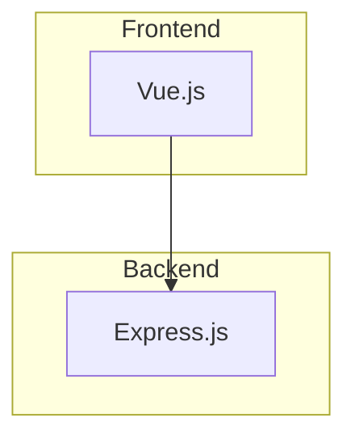

# How to Generate Visual Graphs from Diagrams

## 📊 **Available Diagram Formats**

I've converted all the ASCII text diagrams from your System Analysis and Design document into actual renderable graph formats:

### **1. System Architecture Diagrams** ✅
- **Mermaid Format:** `system_architecture_mermaid.md`
- **PlantUML Format:** `system_architecture_plantuml.puml`
- **Graphviz DOT Format:** `system_architecture_graphviz.md`

### **2. Activity Diagrams** ✅
- **File:** `activity_diagrams.md`
- **Contains:** Trip Planning, Admin Management, Chatbot Interaction, Review Submission workflows
- **Formats:** Both Mermaid and PlantUML versions included

### **3. System Overview Diagrams** ✅
- **High-level system perspective** showing users, core platform, features, and external services
- **Available in all formats** (Mermaid, PlantUML, Graphviz)

### **4. Activity, Context & DFD Diagrams** ✅
- **File:** `activity_context_dfd_diagrams.md` 
- **Contains:** Combined Activity Diagram, Context Diagram, DFD Level 0
- **Format:** Graphviz DOT format for publication-quality graphics

**Best For:** GitHub/GitLab, VS Code, web documentation

---

## 🛠️ **How to Generate Visual Graphs**

### **Method 1: Online Editors (Easiest)**

#### **Mermaid Live Editor**
1. Go to https://mermaid.live/
2. Copy any Mermaid code from `system_architecture_mermaid.md`
3. Paste into the editor
4. Download as PNG/SVG/PDF

#### **PlantUML Online**
1. Go to http://www.plantuml.com/plantuml/
2. Copy the PlantUML code from `system_architecture_plantuml.puml`
3. Paste into the text area
4. Click "Submit" to generate
5. Download the image

#### **Graphviz Online**
1. Go to https://dreampuf.github.io/GraphvizOnline/
2. Copy any DOT code from `system_architecture_graphviz.md`
3. Paste into the editor
4. Download as PNG/SVG

### **Method 2: VS Code Extensions**

#### **For Mermaid**
1. Install "Mermaid Preview" extension
2. Open `system_architecture_mermaid.md`
3. Right-click → "Open Preview to the Side"
4. Export from preview panel

#### **For PlantUML**
1. Install "PlantUML" extension
2. Open `system_architecture_plantuml.puml`
3. Press `Ctrl+Shift+P` → "PlantUML: Preview Current Diagram"
4. Export from preview

#### **For Graphviz**
1. Install "Graphviz Interactive Preview" extension
2. Copy DOT code to a `.dot` file
3. Right-click → "Open Preview to the Side"

### **Method 3: Command Line Tools**

#### **Install Graphviz (Windows)**
```powershell
# Using winget
winget install graphviz

# Using chocolatey
choco install graphviz

# Using scoop
scoop install graphviz
```

#### **Generate Images**
```powershell
# For PNG output
dot -Tpng system_diagram.dot -o system_diagram.png

# For SVG output
dot -Tsvg system_diagram.dot -o system_diagram.svg

# For PDF output
dot -Tpdf system_diagram.dot -o system_diagram.pdf
```

### **Method 4: GitHub/GitLab Integration**

#### **GitHub README**
```markdown
# System Architecture


\```
```

#### **GitLab Wiki**
- GitLab supports both Mermaid and PlantUML natively
- Just paste the code in markdown code blocks

---

## 🎯 **Recommended Approach**

### **For Quick Previews:**
1. **Mermaid Live Editor** - Fast, no installation needed
2. Copy diagram code from `system_architecture_mermaid.md`
3. Generate PNG/SVG for presentations

### **For Professional Documents:**
1. **PlantUML** - Better for formal documentation
2. Use the `.puml` file with PlantUML server
3. Generate high-resolution images

### **For Custom Styling:**
1. **Graphviz** - Most flexible for custom appearance
2. Modify DOT files for specific styling needs
3. Generate publication-quality graphics

### **For Development Workflow:**
1. **VS Code Extensions** - Integrated with your development environment
2. Live preview while editing
3. Easy export and sharing

---

## 📁 **File Structure**

```
backend/scripts/
├── system_analysis_design.md (✅ Updated with Mermaid)
└── diagrams/
    ├── system_architecture_mermaid.md (✅ Architecture + Overview)
    ├── system_architecture_plantuml.puml (✅ Architecture + Overview)
    ├── system_architecture_graphviz.md (✅ Architecture + Overview)
    ├── activity_diagrams.md (✅ User workflows - Mermaid/PlantUML)
    ├── activity_context_dfd_diagrams.md (✅ NEW: Combined Activity, Context, DFD)
    └── README_diagram_generation.md (📖 This guide)
```

## 🚀 **Quick Start Guide**

1. **Choose your diagram type:**
   - **System Overview** for high-level system perspective
   - **Architecture Diagrams** for technical component details
   - **Activity Diagrams** for user workflow processes
   - **Context & DFD** for system boundaries and data flows

2. **Choose your preferred format:**
   - **Mermaid** for web documentation
   - **PlantUML** for UML diagrams
   - **Graphviz** for custom styling and publication quality

3. **Go to the corresponding online editor:**
   - Mermaid: https://mermaid.live/
   - PlantUML: http://www.plantuml.com/plantuml/
   - Graphviz: https://dreampuf.github.io/GraphvizOnline/

4. **Copy-paste the code and generate your visual diagrams!**

All your text-based architectural diagrams are now ready to be converted into professional visual graphics! 🎨