# Naujan Tourism System - Activity, Context, and DFD Level 0 Diagrams

## Single Combined Activity Diagram (DOT Format)

```dot
digraph UnifiedActivityDiagram {
    rankdir=TB;
    node [style=filled, fontsize=16, fontname="Arial Bold", width=1.6, height=1.0];
    edge [fontsize=11, fontname="Arial"];
    graph [fontsize=18, fontname="Arial Bold", splines=ortho, nodesep=0.8, ranksep=1.2];
    
    // Title
    label="Naujan Tourism System - Unified Activity Diagram";
    labelloc=top;
    fontsize=20;
    fontname="Arial Bold";
    
    // Start and End nodes
    start [label="SYSTEM\nSTART", shape=ellipse, fillcolor=lightgreen, width=1.8, height=1.2, fontsize=14];
    end [label="SYSTEM\nEND", shape=ellipse, fillcolor=lightcoral, width=1.8, height=1.2, fontsize=14];
    
    // User Authentication Flow
    checkUserType [label="Determine\nUser Type", shape=diamond, fillcolor=lightyellow, width=1.8, height=1.2];
    guestAccess [label="Guest Access\nGranted", shape=box, fillcolor=lightblue, width=1.6];
    userLogin [label="User Login\nProcess", shape=box, fillcolor=lightblue, width=1.6];
    adminLogin [label="Admin Login\nProcess", shape=box, fillcolor=lightblue, width=1.6];
    registration [label="User\nRegistration", shape=box, fillcolor=lightblue, width=1.6];
    
    // Main Activity Branches
    browseAttractions [label="Browse\nAttractions", shape=box, fillcolor=lightcyan, width=1.6];
    manageSite [label="Manage Site\nContent", shape=box, fillcolor=lightcyan, width=1.6];
    planTrip [label="Plan Trip\nItinerary", shape=box, fillcolor=lightcyan, width=1.6];
    writeReview [label="Write\nReview", shape=box, fillcolor=lightcyan, width=1.6];
    useChatbot [label="Use Tourism\nChatbot", shape=box, fillcolor=lightcyan, width=1.6];
    
    // Trip Planning Detailed Flow
    selectAttractions [label="Select\nAttractions", shape=box, fillcolor=lightblue];
    checkWeather [label="Check Weather\nInformation", shape=box, fillcolor=lightblue];
    createItinerary [label="Create\nItinerary", shape=box, fillcolor=lightblue];
    optimizeRoute [label="Optimize\nRoute", shape=box, fillcolor=lightblue];
    saveItinerary [label="Save\nItinerary", shape=box, fillcolor=lightblue];
    
    // Admin Management Flow
    addAttraction [label="Add New\nAttraction", shape=box, fillcolor=lightgreen];
    editContent [label="Edit Existing\nContent", shape=box, fillcolor=lightgreen];
    moderateReviews [label="Moderate\nReviews", shape=box, fillcolor=lightgreen];
    manageUsers [label="Manage\nUsers", shape=box, fillcolor=lightgreen];
    
    // Review Process Flow
    selectAttrForReview [label="Select Attraction\nfor Review", shape=box, fillcolor=lightyellow];
    enterRating [label="Enter Star\nRating", shape=box, fillcolor=lightyellow];
    writeComment [label="Write Review\nComment", shape=box, fillcolor=lightyellow];
    submitReview [label="Submit\nReview", shape=box, fillcolor=lightyellow];
    
    // Chatbot Interaction Flow
    selectLanguage [label="Select\nLanguage", shape=box, fillcolor=lightpink];
    askQuestion [label="Ask Tourism\nQuestion", shape=box, fillcolor=lightpink];
    getResponse [label="Receive\nResponse", shape=box, fillcolor=lightpink];
    
    // Decision Points
    userTypeDecision [label="User Type?", shape=diamond, fillcolor=lightyellow, width=1.6, height=1.2];
    authRequired [label="Auth\nRequired?", shape=diamond, fillcolor=lightyellow, width=1.6, height=1.2];
    hasAccount [label="Has\nAccount?", shape=diamond, fillcolor=lightyellow, width=1.6, height=1.2];
    actionChoice [label="Choose\nAction?", shape=diamond, fillcolor=lightyellow, width=1.6, height=1.2];
    adminChoice [label="Admin\nAction?", shape=diamond, fillcolor=lightyellow, width=1.6, height=1.2];
    continueActivity [label="Continue\nActivity?", shape=diamond, fillcolor=lightyellow, width=1.8, height=1.2];
    addMoreAttr [label="Add More\nAttractions?", shape=diamond, fillcolor=lightyellow, width=2.0, height=1.2];
    shareItinerary [label="Share\nItinerary?", shape=diamond, fillcolor=lightyellow, width=1.8, height=1.2];
    
    // Main Flow
    start -> checkUserType;
    checkUserType -> userTypeDecision;
    
    // User Type Routing
    userTypeDecision -> guestAccess [label="Guest"];
    userTypeDecision -> userLogin [label="Registered User"];
    userTypeDecision -> adminLogin [label="Administrator"];
    
    // Authentication Flow
    userLogin -> hasAccount;
    hasAccount -> actionChoice [label="Yes"];
    hasAccount -> registration [label="No"];
    registration -> actionChoice;
    adminLogin -> adminChoice;
    guestAccess -> actionChoice;
    
    // Activity Selection
    actionChoice -> browseAttractions [label="Browse"];
    actionChoice -> planTrip [label="Plan Trip"];
    actionChoice -> writeReview [label="Write Review"];
    actionChoice -> useChatbot [label="Use Chatbot"];
    
    adminChoice -> manageSite [label="Manage Content"];
    adminChoice -> addAttraction [label="Add Attraction"];
    adminChoice -> editContent [label="Edit Content"];
    adminChoice -> moderateReviews [label="Moderate Reviews"];
    adminChoice -> manageUsers [label="Manage Users"];
    
    // Trip Planning Flow
    planTrip -> selectAttractions;
    selectAttractions -> checkWeather;
    checkWeather -> addMoreAttr;
    addMoreAttr -> selectAttractions [label="Yes"];
    addMoreAttr -> createItinerary [label="No"];
    createItinerary -> optimizeRoute;
    optimizeRoute -> saveItinerary;
    saveItinerary -> shareItinerary;
    shareItinerary -> continueActivity;
    
    // Review Flow
    writeReview -> selectAttrForReview;
    selectAttrForReview -> enterRating;
    enterRating -> writeComment;
    writeComment -> submitReview;
    submitReview -> continueActivity;
    
    // Chatbot Flow
    useChatbot -> selectLanguage;
    selectLanguage -> askQuestion;
    askQuestion -> getResponse;
    getResponse -> continueActivity;
    
    // Browsing Flow
    browseAttractions -> continueActivity;
    
    // Admin Flows
    manageSite -> continueActivity;
    addAttraction -> continueActivity;
    editContent -> continueActivity;
    moderateReviews -> continueActivity;
    manageUsers -> continueActivity;
    
    // Continue or End
    continueActivity -> actionChoice [label="Yes"];
    continueActivity -> end [label="No"];
    shareItinerary -> end [label="End Session"];
}
```



## Context Diagram (DOT Format)

```dot
digraph ContextDiagram {
    rankdir=TB;
    node [style=filled];
    
    // Title
    label="Naujan Tourism System - Context Diagram";
    labelloc=top;
    fontsize=16;
    fontname="Arial Bold";
    
    // Central system
    system [label="Naujan Tourism\nApplication\nSystem", shape=circle, fillcolor=lightblue, width=2.5, height=2.5];
    
    // External entities
    tourist [label="Tourist/Visitor", shape=box, fillcolor=lightgreen];
    regUser [label="Registered\nUser", shape=box, fillcolor=lightgreen];
    admin [label="System\nAdministrator", shape=box, fillcolor=lightgreen];
    weatherAPI [label="OpenWeather\nAPI Service", shape=box, fillcolor=lightyellow];
    cloudinary [label="Cloudinary\nImage CDN", shape=box, fillcolor=lightyellow];
    mapsAPI [label="Maps API\nService", shape=box, fillcolor=lightgray];
    
    // Data flows from external entities to system
    tourist -> system [label="Browse attractions\nView details\nCheck weather\nUse chatbot"];
    regUser -> system [label="Create itineraries\nWrite reviews\nManage profile\nPlan trips"];
    admin -> system [label="Manage attractions\nModerate content\nManage users\nSystem admin"];
    weatherAPI -> system [label="Weather data\nForecast info\nLocation weather"];
    cloudinary -> system [label="Image storage\nCDN services\nMedia hosting"];
    mapsAPI -> system [label="Map data\nRoute information\nLocation services", style=dashed];
    
    // Data flows from system to external entities
    system -> tourist [label="Attraction information\nWeather data\nChatbot responses\nTourism guidance"];
    system -> regUser [label="Saved itineraries\nPersonalized content\nNotifications\nReview confirmations"];
    system -> admin [label="System reports\nUser statistics\nContent status\nAdmin dashboard"];
    system -> weatherAPI [label="Location requests\nWeather queries\nAPI calls"];
    system -> cloudinary [label="Image uploads\nStorage requests\nMedia files"];
    system -> mapsAPI [label="Route requests\nLocation queries\nMapping data", style=dashed];
    
    // Position external entities around the system
    {rank=same; tourist, regUser, admin}
    {rank=same; weatherAPI, cloudinary, mapsAPI}
    
    // Legend
    subgraph cluster_legend {
        label="Legend";
        color=gray;
        style=filled;
        fillcolor=lightgray;
        
        LegendUser [label="System Users", shape=box, fillcolor=lightgreen];
        LegendAPI [label="External APIs", shape=box, fillcolor=lightyellow];
        LegendFuture [label="Future Feature", shape=box, fillcolor=lightgray];
        LegendSystem [label="Main System", shape=circle, fillcolor=lightblue];
    }
}
```



## Data Flow Diagram Level 0 (Diagram 0) (DOT Format)

```dot
digraph DFD_Level0 {
    rankdir=TB;
    node [style=filled, fontsize=16, fontname="Arial Bold"];
    edge [fontsize=10, fontname="Arial"];
    graph [fontsize=18, fontname="Arial Bold", nodesep=1.0, ranksep=1.2];
    
    // Title
    label="Naujan Tourism System - DFD Level 0 (Diagram 0)";
    labelloc=top;
    fontsize=20;
    fontname="Arial Bold";
    
    // External entities
    tourist [label="TOURIST/\nVISITOR", shape=box, fillcolor=lightgreen, width=1.8, height=1.0];
    regUser [label="REGISTERED\nUSER", shape=box, fillcolor=lightgreen, width=1.8, height=1.0];
    admin [label="SYSTEM\nADMINISTRATOR", shape=box, fillcolor=lightgreen, width=2.0, height=1.0];
    weatherAPI [label="WEATHER\nAPI", shape=box, fillcolor=lightyellow, width=1.6, height=1.0];
    imageAPI [label="IMAGE\nCDN", shape=box, fillcolor=lightyellow, width=1.6, height=1.0];
    
    // Main processes
    p1 [label="1.0\nMANAGE USER\nAUTHENTICATION", shape=circle, fillcolor=lightblue, width=2.0, height=2.0, fontsize=11];
    p2 [label="2.0\nMANAGE\nATTRACTIONS", shape=circle, fillcolor=lightblue, width=2.0, height=2.0, fontsize=11];
    p3 [label="3.0\nPLAN TRIP\nITINERARIES", shape=circle, fillcolor=lightblue, width=2.0, height=2.0, fontsize=11];
    p4 [label="4.0\nMANAGE REVIEWS\n& RATINGS", shape=circle, fillcolor=lightblue, width=2.0, height=2.0, fontsize=11];
    p5 [label="5.0\nPROVIDE TOURISM\nCHATBOT", shape=circle, fillcolor=lightblue, width=2.0, height=2.0, fontsize=11];
    p6 [label="6.0\nINTEGRATE WEATHER\nINFORMATION", shape=circle, fillcolor=lightblue, width=2.0, height=2.0, fontsize=11];
    
    // Data stores
    d1 [label="D1 | USERS", shape=note, fillcolor=lightcyan, width=1.8, height=0.8, fontsize=11];
    d2 [label="D2 | ATTRACTIONS", shape=note, fillcolor=lightcyan, width=2.0, height=0.8, fontsize=11];
    d3 [label="D3 | ITINERARIES", shape=note, fillcolor=lightcyan, width=2.0, height=0.8, fontsize=11];
    d4 [label="D4 | REVIEWS", shape=note, fillcolor=lightcyan, width=1.8, height=0.8, fontsize=11];
    d5 [label="D5 | CONVERSATIONS", shape=note, fillcolor=lightcyan, width=2.2, height=0.8, fontsize=11];
    d6 [label="D6 | WEATHER DATA", shape=note, fillcolor=lightcyan, width=2.2, height=0.8, fontsize=11];
    
    // Tourist interactions
    tourist -> p2 [label="attraction_request"];
    p2 -> tourist [label="attraction_details"];
    tourist -> p5 [label="tourism_questions"];
    p5 -> tourist [label="tourism_information"];
    tourist -> p6 [label="weather_request"];
    p6 -> tourist [label="weather_information"];
    
    // Registered User interactions
    regUser -> p1 [label="login_credentials"];
    p1 -> regUser [label="authentication_status"];
    regUser -> p3 [label="itinerary_request"];
    p3 -> regUser [label="saved_itinerary"];
    regUser -> p4 [label="review_submission"];
    p4 -> regUser [label="review_confirmation"];
    
    // Admin interactions
    admin -> p1 [label="user_management"];
    p1 -> admin [label="user_data"];
    admin -> p2 [label="attraction_updates"];
    p2 -> admin [label="attraction_status"];
    admin -> p4 [label="review_moderation"];
    p4 -> admin [label="pending_reviews"];
    
    // External API interactions
    p6 -> weatherAPI [label="weather_query"];
    weatherAPI -> p6 [label="weather_response"];
    p2 -> imageAPI [label="image_upload"];
    imageAPI -> p2 [label="image_url"];
    
    // Data store read/write interactions
    p1 -> d1 [label="user_data"];
    d1 -> p1 [label="user_information"];
    d1 -> p3 [label="user_profile"];
    d1 -> p4 [label="user_details"];
    
    p2 -> d2 [label="attraction_data"];
    d2 -> p2 [label="attraction_information"];
    d2 -> p3 [label="available_attractions"];
    d2 -> p4 [label="attraction_details"];
    d2 -> p5 [label="attraction_info"];
    
    p3 -> d3 [label="itinerary_data"];
    d3 -> p3 [label="saved_itineraries"];
    
    p4 -> d4 [label="review_data"];
    d4 -> p4 [label="review_information"];
    d4 -> p2 [label="attraction_reviews"];
    
    p5 -> d5 [label="conversation_data"];
    d5 -> p5 [label="chat_history"];
    
    p6 -> d6 [label="weather_data"];
    d6 -> p6 [label="cached_weather"];
    d6 -> p3 [label="weather_info"];
    
    // Position elements for better layout
    {rank=same; tourist, regUser, admin}
    {rank=same; p1, p2, p3}
    {rank=same; p4, p5, p6}
    {rank=same; d1, d2, d3}
    {rank=same; d4, d5, d6}
    {rank=same; weatherAPI, imageAPI}
}
```



---

## Usage Instructions

### **For Graphviz Online Editor:**
1. Go to https://dreampuf.github.io/GraphvizOnline/
2. Copy any of the DOT code blocks above
3. Paste into the editor
4. Generate PNG/SVG instantly

### **For Command Line (if Graphviz installed):**
```powershell
# Generate individual diagrams
dot -Tpng combined_activity.dot -o combined_activity.png
dot -Tpng context_diagram.dot -o context_diagram.png
dot -Tpng dfd_level0.dot -o dfd_level0.png

# Generate SVG for scalable graphics
dot -Tsvg combined_activity.dot -o combined_activity.svg
dot -Tsvg context_diagram.dot -o context_diagram.svg
dot -Tsvg dfd_level0.dot -o dfd_level0.svg
```

### **For VS Code:**
1. Install "Graphviz (dot) language support" extension
2. Save DOT code to `.dot` files
3. Use "Graphviz Interactive Preview" for live preview

---

## Diagram Descriptions

### **Combined Activity Diagram**
Shows four main business processes:
- **Trip Planning Process** (Blue) - User journey from login to saving itineraries
- **Admin Management Process** (Green) - Administrative tasks and content management
- **Review Submission Process** (Orange) - User review workflow
- **Chatbot Interaction Process** (Purple) - AI assistant conversation flow

### **Context Diagram**
Defines system boundaries and shows:
- **External entities** (users and APIs)
- **Data flows** between entities and the system
- **System scope** and interfaces

### **DFD Level 0 (Diagram 0)**
Decomposes the system into:
- **6 main processes** (numbered 1.0-6.0)
- **6 data stores** (D1-D6)
- **Detailed data flows** with descriptive labels
- **Process interactions** and data dependencies