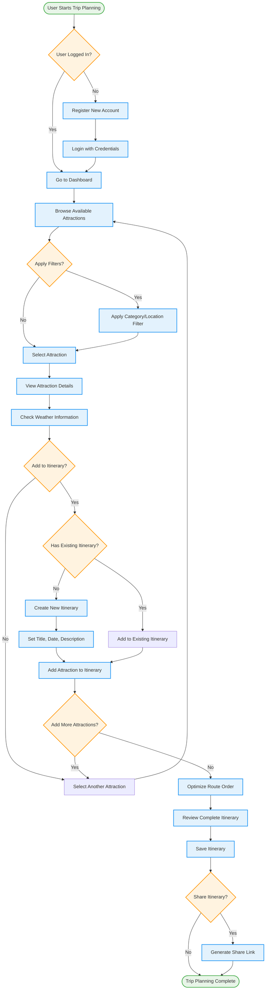
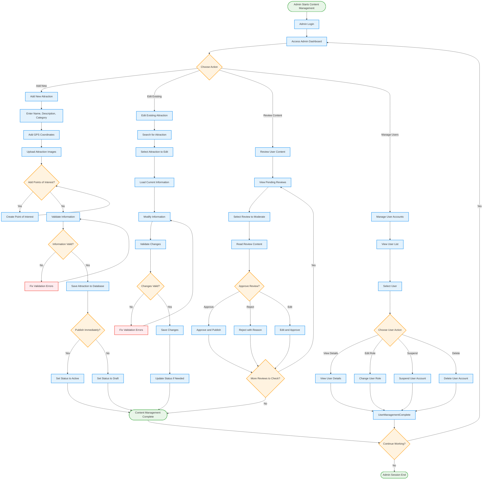
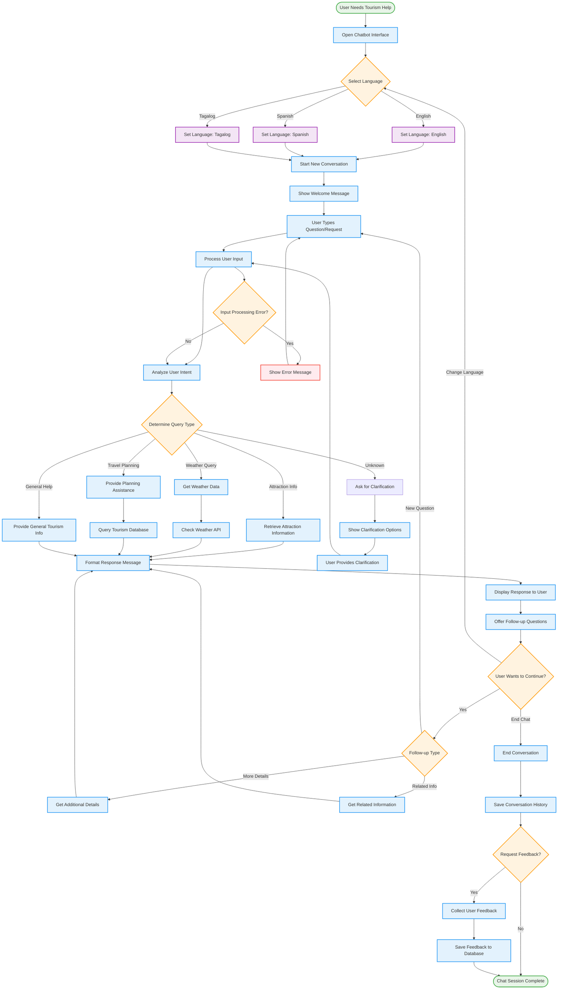

# Naujan Tourism System - Activity Diagrams

## User Trip Planning Activity Diagram (Mermaid)



## Attraction Management Activity Diagram (Mermaid)



## Chatbot Interaction Activity Diagram (Mermaid)



## User Review Submission Activity Diagram (Mermaid)

```mermaid
flowchart TD
    ReviewStart([User Wants to Write Review]) --> UserLoggedIn{User Logged In?}
    
    UserLoggedIn -->|No| RequireLogin[Require User Login]
    UserLoggedIn -->|Yes| SelectAttraction[Select Attraction to Review]
    
    RequireLogin --> LoginProcess[User Login Process]
    LoginProcess --> SelectAttraction
    
    SelectAttraction --> CheckExistingReview{Has User Reviewed This?}
    CheckExistingReview -->|Yes| ShowExistingReview[Show Existing Review]
    CheckExistingReview -->|No| StartNewReview[Start New Review]
    
    ShowExistingReview --> EditOrNew{Edit Existing or Create New?}
    EditOrNew -->|Edit| LoadExistingData[Load Existing Review Data]
    EditOrNew -->|New| CannotReview[Show: Cannot Review Twice]
    CannotReview --> ReviewComplete([Review Process Complete])
    
    LoadExistingData --> EditReviewForm[Edit Review Form]
    StartNewReview --> NewReviewForm[New Review Form]
    
    EditReviewForm --> EnterRating[Enter/Update Star Rating]
    NewReviewForm --> EnterRating
    
    EnterRating --> RatingValid{Rating Between 1-5?}
    RatingValid -->|No| ShowRatingError[Show Rating Error]
    RatingValid -->|Yes| EnterComment[Enter Review Comment]
    ShowRatingError --> EnterRating
    
    EnterComment --> CommentLength{Comment Length OK?}
    CommentLength -->|Too Short| ShowLengthError[Show: Comment Too Short]
    CommentLength -->|Too Long| ShowLengthError
    CommentLength -->|Valid| ValidateContent[Validate Content]
    ShowLengthError --> EnterComment
    
    ValidateContent --> ContentClean{Content Appropriate?}
    ContentClean -->|No| ShowContentError[Show: Inappropriate Content]
    ContentClean -->|Yes| UploadPhotos{Upload Photos?}
    ShowContentError --> EnterComment
    
    UploadPhotos -->|Yes| SelectPhotos[Select Photos to Upload]
    UploadPhotos -->|No| PreviewReview[Preview Review]
    
    SelectPhotos --> ValidatePhotos[Validate Photo Format/Size]
    ValidatePhotos --> PhotosValid{Photos Valid?}
    PhotosValid -->|No| ShowPhotoError[Show Photo Error]
    PhotosValid -->|Yes| UploadToCloud[Upload to Cloudinary]
    ShowPhotoError --> SelectPhotos
    
    UploadToCloud --> PreviewReview
    PreviewReview --> UserConfirm{User Confirms Submission?}
    
    UserConfirm -->|No| BackToEdit[Back to Edit Form]
    UserConfirm -->|Yes| SubmitReview[Submit Review]
    BackToEdit --> EditReviewForm
    
    SubmitReview --> SaveToDatabase[Save to Database]
    SaveToDatabase --> SetPendingStatus[Set Status: Pending Approval]
    SetPendingStatus --> NotifyModerators[Notify Moderators]
    NotifyModerators --> ShowSuccessMessage[Show Success Message]
    ShowSuccessMessage --> OfferMoreReviews{Review Another Attraction?}
    
    OfferMoreReviews -->|Yes| SelectAttraction
    OfferMoreReviews -->|No| ReviewComplete
    
    %% Error Handling
    SaveToDatabase --> DatabaseError{Database Error?}
    DatabaseError -->|Yes| ShowDatabaseError[Show Database Error]
    DatabaseError -->|No| SetPendingStatus
    ShowDatabaseError --> UserConfirm
    
    %% Styling
    classDef startEnd fill:#e8f5e8,stroke:#4caf50,stroke-width:2px
    classDef process fill:#e3f2fd,stroke:#2196f3,stroke-width:2px
    classDef decision fill:#fff3e0,stroke:#ff9800,stroke-width:2px
    classDef error fill:#ffebee,stroke:#f44336,stroke-width:2px
    classDef success fill:#e8f5e8,stroke:#4caf50,stroke-width:2px
    
    class ReviewStart,ReviewComplete startEnd
    class RequireLogin,LoginProcess,SelectAttraction,ShowExistingReview,LoadExistingData,EditReviewForm,StartNewReview,NewReviewForm,EnterRating,EnterComment,ValidateContent,SelectPhotos,ValidatePhotos,UploadToCloud,PreviewReview,BackToEdit,SubmitReview,SaveToDatabase,SetPendingStatus,NotifyModerators process
    class UserLoggedIn,CheckExistingReview,EditOrNew,RatingValid,CommentLength,ContentClean,UploadPhotos,PhotosValid,UserConfirm,OfferMoreReviews,DatabaseError decision
    class ShowRatingError,ShowLengthError,ShowContentError,ShowPhotoError,ShowDatabaseError,CannotReview error
    class ShowSuccessMessage success
```



---

## PlantUML Activity Diagrams

```plantuml
@startuml TripPlanningActivity
title Trip Planning Activity Diagram

start
:User starts trip planning;

if (User logged in?) then (no)
    :Register new account;
    :Login with credentials;
else (yes)
endif

:Go to dashboard;
:Browse available attractions;

if (Apply filters?) then (yes)
    :Apply category/location filter;
else (no)
endif

:Select attraction;
:View attraction details;
:Check weather information;

if (Add to itinerary?) then (no)
    :Select another attraction;
    stop
else (yes)
endif

if (Has existing itinerary?) then (no)
    :Create new itinerary;
    :Set title, date, description;
else (yes)
endif

:Add attraction to itinerary;

if (Add more attractions?) then (yes)
    :Select another attraction;
    backward:Browse available attractions;
else (no)
endif

:Optimize route order;
:Review complete itinerary;
:Save itinerary;

if (Share itinerary?) then (yes)
    :Generate share link;
else (no)
endif

stop

@enduml
```

```plantuml
@startuml ChatbotActivity
title Chatbot Interaction Activity Diagram

start
:User needs tourism help;
:Open chatbot interface;

switch (Select language?)
case (English)
    :Set language: English;
case (Spanish)  
    :Set language: Spanish;
case (Tagalog)
    :Set language: Tagalog;
endswitch

:Start new conversation;
:Show welcome message;

repeat
    :User types question/request;
    :Process user input;
    :Analyze user intent;
    
    switch (Query type?)
    case (Attraction info)
        :Retrieve attraction information;
    case (Weather query)
        :Get weather data;
    case (Travel planning)
        :Provide planning assistance;
    case (General help)
        :Provide general tourism info;
    case (Unknown)
        :Ask for clarification;
        :Show clarification options;
        :User provides clarification;
        backward:Process user input;
    endswitch
    
    :Format response message;
    :Display response to user;
    :Offer follow-up questions;
    
repeat while (User wants to continue?) is (yes)
->no;

:End conversation;
:Save conversation history;

if (Request feedback?) then (yes)
    :Collect user feedback;
    :Save feedback to database;
else (no)
endif

stop

@enduml
```

---

**Usage Instructions:**
1. Copy any activity diagram code and paste into Mermaid Live Editor (https://mermaid.live/) or PlantUML online
2. The diagrams show detailed workflows for key system processes
3. Use these diagrams for system documentation, user training, and development planning
4. Each diagram includes error handling and decision points for complete workflow coverage