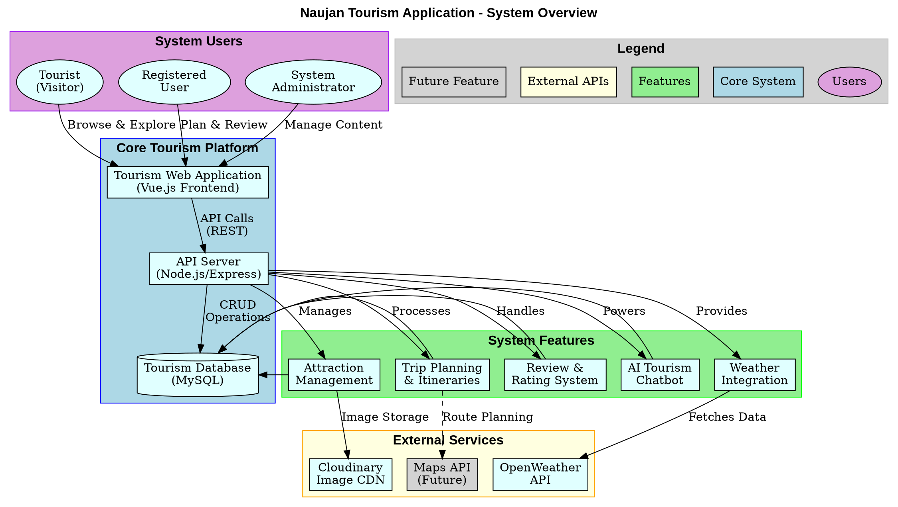
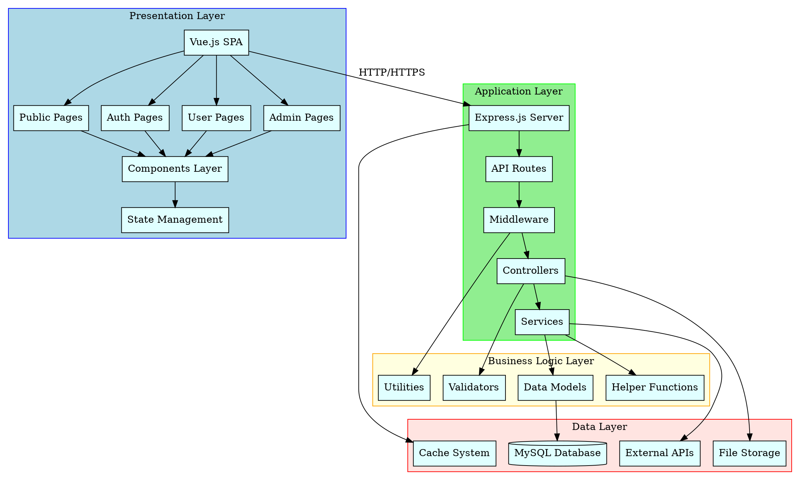
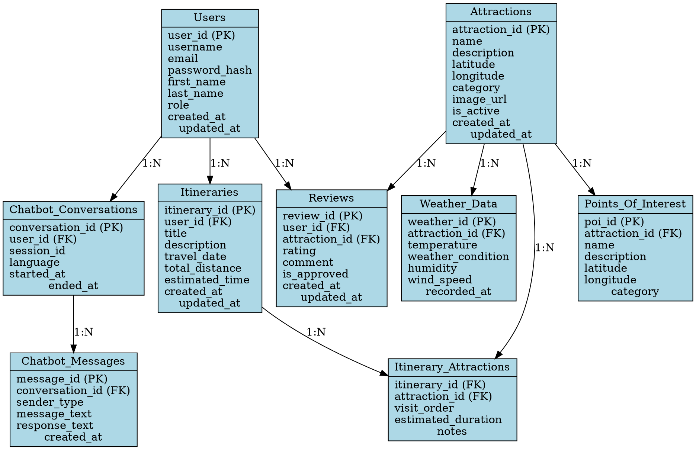
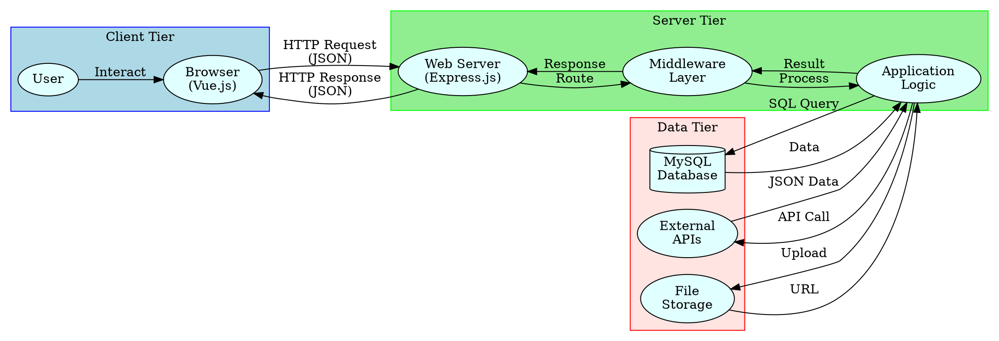
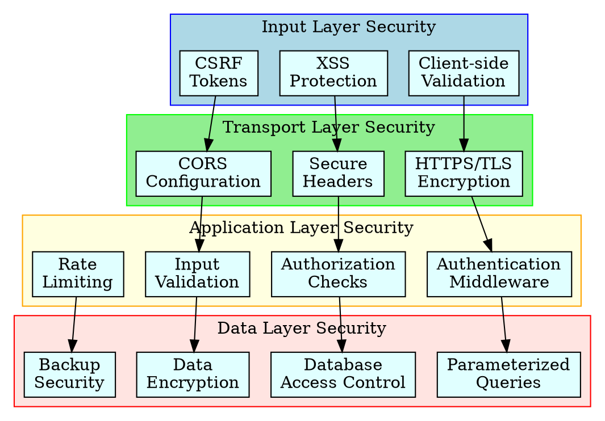

# Naujan Tourism System - Graphviz DOT Diagrams

## System Overview (High-Level DOT Format)



## System Architecture (DOT Format)



## Database Entity Relationship (DOT Format)



## Data Flow Diagram (DOT Format)



## Security Architecture (DOT Format)



}
```

---

**Usage Instructions:**

1. **For Graphviz:**
   - Install Graphviz: `winget install graphviz` (Windows) or visit https://graphviz.org/
   - Save any diagram code to a `.dot` file
   - Generate image: `dot -Tpng filename.dot -o output.png`
   - Or use online: http://magjac.com/graphviz-visual-editor/

2. **For Online Tools:**
   - Use online Graphviz editors: https://dreampuf.github.io/GraphvizOnline/
   - Copy and paste the DOT code directly

3. **VS Code Extensions:**
   - Install "Graphviz (dot) language support" extension
   - Install "Graphviz Interactive Preview" for live preview

**Note:** Activity Diagram, Context Diagram, and DFD Level 0 have been moved to a separate file: `activity_context_dfd_diagrams.md`