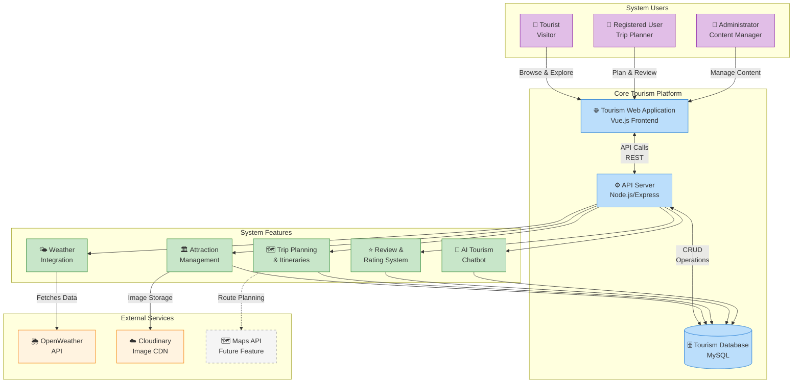
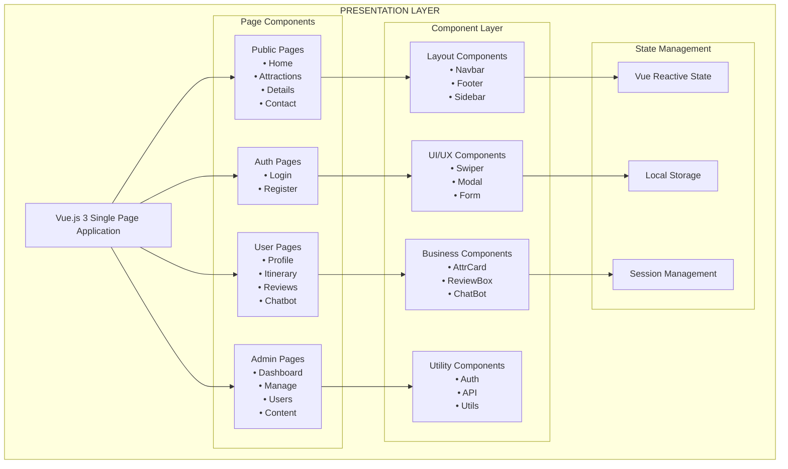
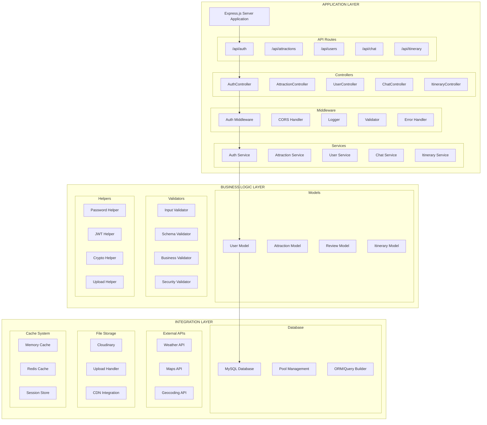
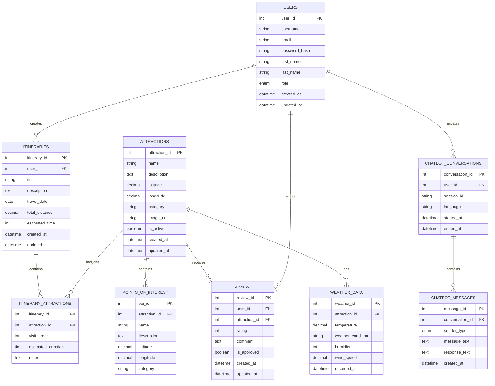
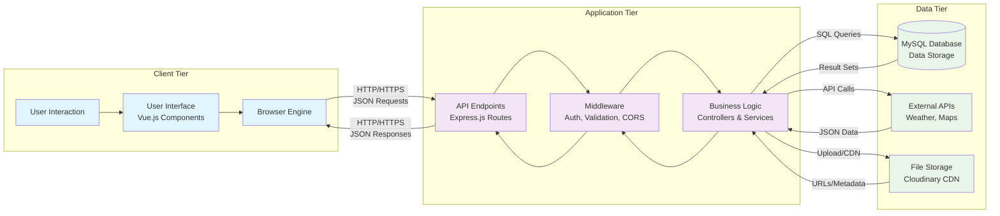
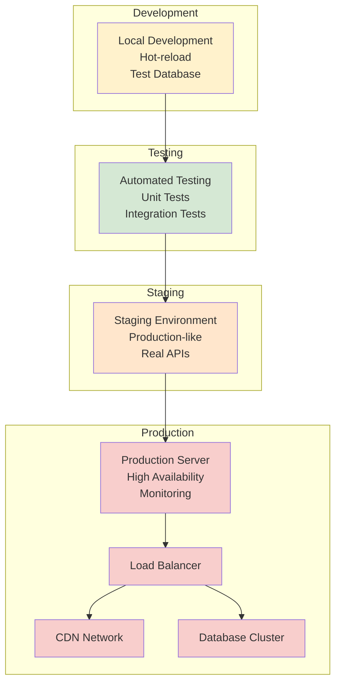

# Naujan Tourism System Architecture Diagrams (Mermaid)

## System Overview (High-Level)

## Frontend Architecture

## Backend Architecture

## Database Schema (ERD)

## Data Flow Architecture

## Security Architecture

```mermaid
graph TD
    subgraph "Security Layers"
        IL[Input Layer Security]
        TL[Transport Layer Security]
        AL[Application Layer Security]
        DL[Data Layer Security]
    end
    
    subgraph "Input Security"
        CSV[Client-side Validation]
        XSS[XSS Protection]
        CSRF[CSRF Tokens]
    end
    
    subgraph "Transport Security"
        HTTPS[HTTPS/TLS Encryption]
        SH[Secure Headers]
        CORS_SEC[CORS Configuration]
    end
    
    subgraph "Application Security"
        AUTH[Authentication Middleware]
        AUTHZ[Authorization Checks]
        VAL_SEC[Input Validation]
        RL[Rate Limiting]
    end
    
    subgraph "Data Security"
        PQ[Parameterized Queries]
        DAC[Database Access Control]
        DE[Data Encryption]
        BS[Backup Security]
    end
    
    IL --> CSV
    IL --> XSS
    IL --> CSRF
    
    TL --> HTTPS
    TL --> SH
    TL --> CORS_SEC
    
    AL --> AUTH
    AL --> AUTHZ
    AL --> VAL_SEC
    AL --> RL
    
    DL --> PQ
    DL --> DAC
    DL --> DE
    DL --> BS
```

## Deployment Architecture

---

**Usage Instructions:**
1. Copy any diagram code and paste it into Mermaid Live Editor: https://mermaid.live/
2. Use in VS Code with Mermaid Preview extension
3. Include in documentation platforms that support Mermaid (GitHub, GitLab, etc.)
4. Export as PNG/SVG from Mermaid Live Editor for presentations